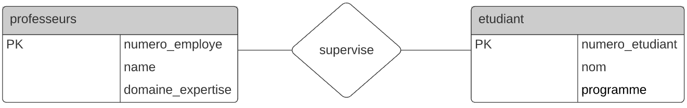
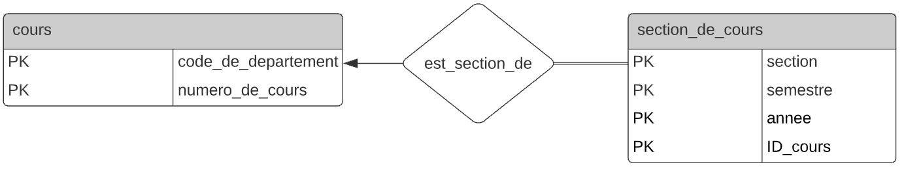
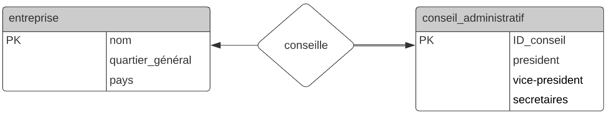
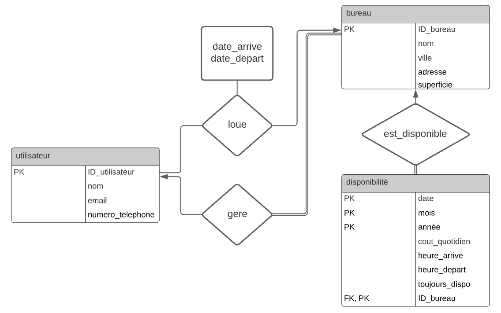
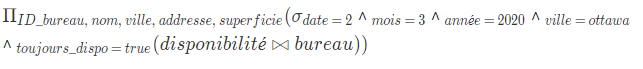
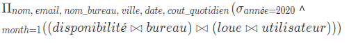
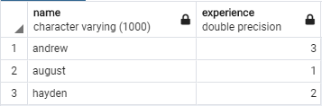
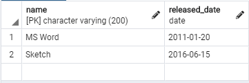
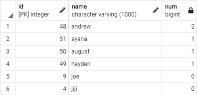
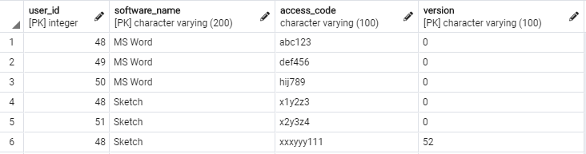

A1\
a)

b)

c)


A2\



A3

a)\
Latex:
$\Pi_{ID\_bureau,\ nom,\ ville,\ addresse,\ superficie}(\sigma_{date\ =\ 2}$ ˄ $_{mois\ =\ 3}$ ˄ $_{année\ =\ 2020}$ ˄ $_{ville\ =\ ottawa}$ ˄ $_{toujours\_dispo\ =\ true}(disponibilité \bowtie bureau))$

Image:\



b)\
Latex:
$\Pi_{nom,\ email,\ nom\_bureau,\ ville,\ date,\ cout\_quotidien}(\sigma_{année = 2020}$ ˄ $_{month = 1}((disponibilité \bowtie bureau) \bowtie (loue\bowtie utilisateur)))$

Image:\


B1\
a)\


b)\



c)\
Si on regroupe uniquement par nom, il serait possible d'avoir plusieurs id associés à un groupe. PSQL ne pourra donc pas déterminer lequel des id elle doit prendre. Cela peut être corrigé en regroupant par nom et id.

```
WITH users_2019 (id, name) AS
 (SELECT *
 FROM users
 WHERE join_date BETWEEN '2019-01-01' AND '2019-12-31')
SELECT id,
 name,
 count(licenses.access_code) AS num
FROM users_2019
LEFT JOIN licenses ON licenses.user_id = id
GROUP BY id, name
ORDER BY num DESC;
```

B2\
a)
```
SELECT name
 	FROM users
	WHERE join_date < '2020-01-01'
```
b)
```
SELECT id,
 name,
 count(licenses.access_code) AS num
FROM users
LEFT JOIN licenses ON licenses.user_id = id
GROUP BY id, name
ORDER BY num DESC;
```
c)
```
INSERT INTO users (id, name, join_date)
VALUES
 	(9, 'joe', '2018-01-01'),
 	(4, 'jiji', '2018-01-01');
SELECT id,
  name,
  count(licenses.access_code) AS num
FROM users
LEFT JOIN licenses ON licenses.user_id = id
GROUP BY id, name
ORDER BY num DESC;
```
Un RIGHT JOIN ne fonctionnerait pas dans cette situation.\
Résultat:\


d)
```
UPDATE softwares SET version = 51, released_date='2020-01-01' 
WHERE name = 'Sketch'
```

B3

a)
```
BEGIN;
ALTER TABLE licenses
ADD version varchar(100);
UPDATE licenses SET version = 0 WHERE version is NULL;
```
b)
```
ALTER TABLE softwares 
	DROP CONSTRAINT softwares_pkey,
	ADD CONSTRAINT softwares_pkey PRIMARY KEY(name, version);
```
c)
```
ALTER TABLE licenses
	DROP CONSTRAINT licenses_pkey,
	ADD CONSTRAINT licenses_pkey PRIMARY KEY(user_id, software_name, version);
COMMIT;
```
Test:
```
INSERT INTO licenses (user_id, software_name, access_code, version)
VALUES
 ((SELECT min(id) FROM users WHERE name = 'andrew'), 'Sketch', 'xxxyyy111', '52');
SELECT * FROM licenses;
```


d)
```
INSERT INTO licenses (user_id, software_name, access_code, version)
SELECT id, 'Sketch', '1monthfree', '52' FROM users AS u WHERE NOT EXISTS(
	SELECT * FROM licenses AS license WHERE u.id = license.user_ID AND license.software_name = 'Sketch' ) 
```


